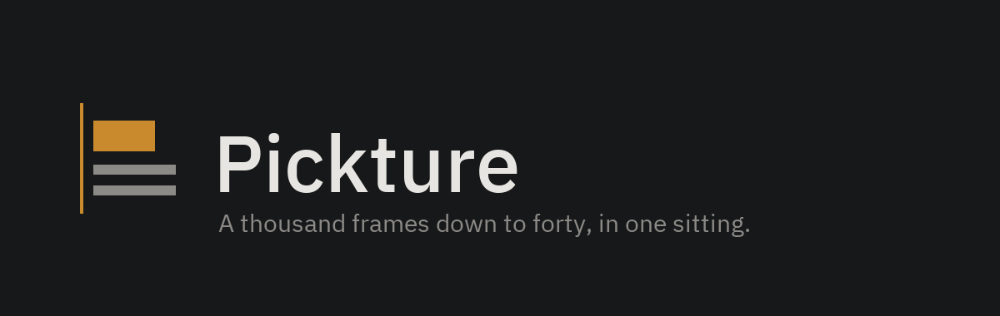

**[pickture website](https://vincent-bdn.github.io/pickture/)** ·
[install](https://vincent-bdn.github.io/pickture/install.html) ·
[who writes this](https://vincent-bdn.github.io/pickture/about.html) ·
[releases](https://github.com/Vincent-Bdn/pickture/releases)

A keyboard-driven photo-culling tool. A thousand frames down to forty, in one
sitting. Keepers are copied to a destination folder; originals are never touched.

Pickture is for the part of the job that is *deciding*, not editing. After a
shoot you have 300–1,200 frames and maybe 5% are worth keeping — the bottleneck
is moving through them fast enough to hold a judgement in your head. The four
image operations exist so the twenty keepers that need a small correction don't
force you to open Lightroom at all.

## The loop

| Key | Action |
|---|---|
| `←` `→` | previous / next frame |
| `↵` | **enhance** — opens the confirm page for this frame |
| `^↵` | keep as shot, skipping the enhance page |
| `Del` / `⌫` | pass, advance |
| `E` | same as `↵` |
| `Z` | hold to inspect at 1:1 |
| `[` `]` | rotate ±90° |
| `O` / `⇧O` | switch working folder / OS folder picker |
| `S` / `⇧S` | destination menu / choose destination folder |
| `/` | reveal the full shortcut list in the status bar |
| `esc` `↵` | cancel / confirm on the enhance page |

The core keys are permanently visible in the status bar, so no shortcut lives
only in this file.

**Choosing a frame goes through the enhance page.** `↵` opens it rather than
writing immediately; confirming there with no effect selected saves the original.
So the common case is still two keys, and the case where a frame needs a
correction never requires a different one. `^↵` is the escape hatch for frames
you know are fine as shot.

## Switching folders

The working path in the title bar **is** the folder switcher. Nothing is torn
down when you change folders:

- Each folder keeps its own session — cursor, keeps, passes, per-frame edits and
  its destination.
- Returning lands you on the frame you left, with the counts intact.
- Sessions persist across quits, so this doubles as resume-where-you-left-off.
- Thumbnail decoding for the outgoing folder is cancelled rather than paused,
  and its cache stays warm, so switching back is instant.

## Where keepers go

Stated permanently in the info bar beside the keep action, because it is the one
setting that changes what the tool writes to disk. Press `S`:

1. `.\selection\` inside the working folder — the default.
2. Any absolute folder, including another drive. Remembered per working folder.
3. `.\selection\<date>\` — a dated subfolder, for a second pass over a shoot that
   was already culled.

Copies only, never moves. Changing the destination mid-session applies to frames
kept from then on; already-written files stay where they are. A name collision
with a different file appends `_2` and says so in the status bar.

Files are named with the effect applied: `_ORIG`, `_WBV`, `_WBRGB`, `_CUSTOM`.

## Effects

Four operations, applied to a downscaled proxy for the live preview and at full
resolution only on confirm.

- **WB · V** — white balance on the value channel. Adjusts brightness, preserves
  hue and saturation.
- **WB · RGB** — each channel stretched independently. This is the one that
  removes a colour cast.
- **Levels** — manual black point, white point and gamma, dragged directly on the
  histogram. There is no Apply button.
- **Rotation** — 90° steps (lossless) plus a fine angle to ±10°, cropped back to
  the original aspect ratio.

Supported formats: JPEG, PNG, BMP, GIF, TIFF, WebP. Raw is not supported yet.

## Build and run

```powershell
> cargo run --release
```

The website in [`site/`](site/) is hand-written HTML and CSS with no build step,
published to GitHub Pages by `.github/workflows/pages.yml`. Enable it once under
**Settings → Pages → Source → GitHub Actions**.

## Releasing

`.github/workflows/ci.yml` runs formatting, clippy, the tests and a release build
on Windows. It runs on pull requests and on a **manual trigger** — never on a push
to `main`, because a green tick on a commit nobody is shipping says nothing that
building locally has not already said.

Releasing is a button on the Actions tab: run the **CI** workflow and choose a
bump.

| Bump | From `v0.4.2` | From `v0.4.3-beta.1` |
|---|---|---|
| `beta` | `v0.4.3-beta.1` | `v0.4.3-beta.2` |
| `patch` | `v0.4.3` | `v0.4.3` — a beta is *released*, not incremented past |
| `minor` | `v0.5.0` | `v0.5.0` |
| `major` | `v1.0.0` | `v1.0.0` |

The number is computed from the latest tag, so it never depends on anyone
remembering the last one; an exact version can be imposed for the cases no bump
reaches. Betas are marked as pre-releases, which keeps
`/releases/latest/download` pointing at the last stable build.

The tag is created by the run itself, after the tests pass and the binary builds,
so a tag that exists is a tag that built. The number is stamped into `Cargo.toml`
for that build and never committed — the tag is the source of truth, and the
version in the repository is only a starting point.

Windows is the supported target today. The binary is self-contained — no .NET
runtime, no OpenCV DLLs.

## Layout

A Cargo workspace, organised as vertical slices over a thin kernel. The
dependency rule is enforced by Cargo rather than by convention: a slice cannot
import another slice, because it is not in its manifest.

```
crates/
├── kernel/          decode, pixel ops, caches, job pool, sessions — no UI at all
├── ui_kit/          design tokens, painting primitives, the mark, texture store
├── slice_browse/    folder picker, filmstrip, folder switcher
├── slice_view/      the image canvas
├── slice_enhance/   confirm modal, histogram, rotation
├── slice_select/    destination menu and the write path
└── app/             composition root — routes events between slices
```

```
app     → every slice + ui_kit + kernel
slice_* → ui_kit + kernel          (never another slice)
ui_kit  → kernel
kernel  → nothing in this workspace
```

## Why it's fast

Pickture was written in Rust once before and abandoned as too slow. That version
had two specific bugs, both since fixed, and they are worth naming because the
design here is shaped around not repeating them:

- It cloned a full-resolution image and called `load_texture` **inside the frame
  loop**. `load_texture` allocates a new texture and uploads the whole buffer, so
  a static 24 MP photo was re-uploaded sixty times a second. Textures are now
  uploaded exactly once and the handle is cloned per frame.
- It kept every full-resolution decode in an unbounded map, reaching several GB
  after a hundred frames. Caches are now bounded by *bytes*, not item count.

On top of that:

- Thumbnails come from the JPEG embedded in the EXIF block where there is one,
  and otherwise from a DCT-scaled decode at 1/8 — never a full decode.
- Thumbnails are cached on disk, so reopening a folder you have already culled is
  effectively instant.
- Previews decode to display size, not sensor size, and a window of ten frames
  either side of the cursor is decoded ahead of time. Culling is a linear scan,
  so the frame you are about to reach is nearly always already on the GPU.
- Decoding is prioritised by distance from the cursor and cancelled when you
  switch folders. None of it runs on the UI thread.
- Downscaling goes through `fast_image_resize`. `image`'s own resampler costs
  ~210 ms taking a 24 MP frame to 2048 px — more than twice the decode it
  follows, and once it was the single largest cost in showing a photo.
- Scaled JPEG decoding is used only where it actually pays. `jpeg-decoder` is the
  only crate exposing DCT scaling but is ~3x slower per pixel than the zune
  backend `image` uses, so at 1/2 scale it loses to a plain full decode. It is
  used at 1/4 and below, and bypassed above.

- Pixel operations are flat iterations over `&mut [u8]` split across cores, and
  levels collapse to a 256-entry lookup table rather than a `powf` per pixel.

Measured on a 6000×4000 frame (`cargo test -p pickture-kernel --release --test
pipeline -- --ignored --nocapture`): thumbnail 46 ms, preview 75 ms, full decode
82 ms.

## Design

The interface follows a design system with one functional constraint at its
centre: the region immediately around the canvas is achromatic at mid luminance.
You are judging white balance against that surround, so a tinted interface would
make the tool worse at its job. The single accent colour appears only in the
outer chrome — the judgement rail, the kept notch, the keycap, the gamma marker —
and never as a field next to the image.

Typography is IBM Plex Sans and IBM Plex Mono, embedded in the binary under the
SIL Open Font License (see `assets/fonts/OFL.txt`). Every number is set in mono
so digits stay tabular while a handle is being dragged.

## Tests

```powershell
> cargo test --workspace
```

Covers the pixel operations, the caches, the job queue's ordering and
cancellation, session persistence across folder switches, already-kept detection
across every filename suffix, and an end-to-end decode → effect → encode → write
pass that builds its own fixtures.

## Licence

[PolyForm Noncommercial License 1.0.0](https://polyformproject.org/licenses/noncommercial/1.0.0/)
— see [LICENSE.md](LICENSE.md). Free for any noncommercial purpose, including
personal use, charities, schools, public research and government bodies. Read,
build, modify and redistribute on the same terms.

Commercial use is not covered. If you would earn money from the photographs you
cull with it, that needs a separate arrangement — just ask.

Note this makes Pickture **source available**, not **open source**: the Open
Source Definition forbids discriminating between fields of use, and a
noncommercial clause does exactly that. Every line is public and readable; the
label just would not be accurate.

The bundled IBM Plex fonts are separately licensed under the SIL Open Font
License 1.1 (`assets/fonts/OFL.txt`), which permits embedding and
redistribution.
